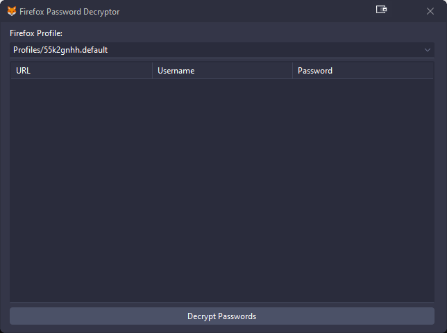

# Firefox_Decrypt-Delphi

This tool can be used to recover passwords from a profile protected by a Master Password as long as the latter is known. If a profile is not protected by a Master Password, passwords are displayed without prompt.

This tool does not try to crack or brute-force the Master Password in any way. If the Master Password is not known it will simply fail to recover any data.

# Detail
This tool decrypt Mozilla Firefox passwords using Firefox NSS (Network Security Services) library.

# Usage

## Console version

```bat
Firefox Password Decryptor
Usage: FirefoxDecrypt.exe [options]

Options:
  -f, --format FORMAT   Output format (human, json, csv)
  -p, --profile PATH    Firefox profile path
  -l, --list            List available profiles
  -c, --choice NUMBER   Profile to use (starts with 1)
  -h, --help            Show this help message
```
## GUI version




# Contributing

Contributions are welcome! If you have suggestions or bug fixes, please fork the repository and submit a pull request.


<p align="center">Made with ❤️ using Delphi RAD Studio</p>
